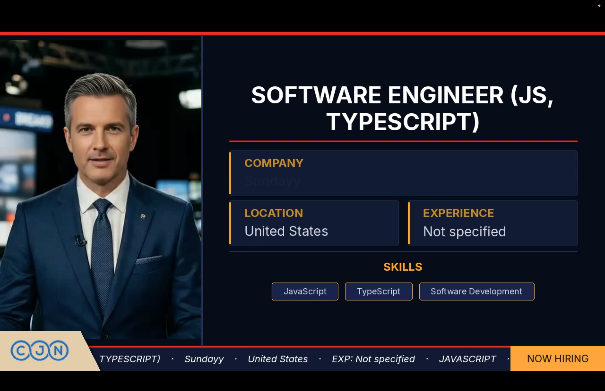

The first time I watched a Wav2Lip output, I thought it had worked.

The mouth was moving. It was in sync with the audio. The face on screen was saying the words I'd fed into the pipeline. By every metric I'd originally set out to hit, the output was correct.

Then I watched it for five more seconds and understood the problem. The mouth was moving, and absolutely nothing else was. No head tilt. No eye movement. No shift in expression. The face was completely frozen except for the one region the model was responsible for. A perfectly synced mouth on a statue.

It looked worse than if the face hadn't moved at all. Close enough to human to register as deeply wrong.

That first output taught me everything I needed to know about what this problem actually was — and it had nothing to do with lip sync.

## The Cost That Made Building Necessary

I didn't start with Wav2Lip. I started with Veo3.

Veo3 generates exactly the kind of video I wanted: a face speaking naturally, looking like something a person recorded, with quality that holds up on YouTube. You describe what you want, it generates the clip. The output is genuinely impressive, and for a single video it's the obvious right answer.

The pipeline I'm building doesn't produce a single video. It produces 190 a day — 10 videos per content section, 19 sections, one channel. Each video runs between 90 and 120 seconds. At conservative API pricing estimates for Veo3-class generation, that math produces a number around $1,000 a day. Per channel. Before anything scales.

That's not a complaint about Veo3's pricing. It's a legitimate product for legitimate use cases. Mine just isn't one of them.

So the question became: what open-source tools exist in Python that I can run locally, wire into a service, and actually iterate on at volume?

## The Hardware Problem Nobody Mentions First

Before I hit any model quality issues, I hit the hardware ceiling.

Running these pipelines on CPU — standard Mac setup, no GPU acceleration — a single 90-second video took close to three hours. That number makes every other consideration irrelevant. You can't evaluate output quality, you can't iterate on parameters, you can't test different approaches when each attempt costs you half a workday.

The fix was MPS — Apple's Metal Performance Shaders, which exposes the GPU on Apple Silicon to PyTorch workloads. The API is the same. You move the tensors to the MPS device instead of CPU and most of the computation moves to the GPU.

The result dropped execution time from three hours to around 36 minutes for a 90-second video. That's still slow by any production standard, but it crossed the threshold from "this is unusable" to "this is testable." Those are meaningfully different situations.

The 36-minute number became the frame for everything that followed. Every model decision, every pipeline choice, every optimization was made inside the constraint of what MPS could run and how fast it could run it. MPS is not CUDA. The newer, more capable models in this space are written for CUDA and have partial or no MPS support. That limitation shaped the entire architecture.

## What Wav2Lip Actually Solves

Wav2Lip is the standard open-source lip sync model. It takes a face image — or a short face video — and an audio file, and outputs a video where the mouth region is animated in sync with the audio. The sync quality is good. It handles different voices, different pacing, different audio lengths. For what it's designed to do, it works.

What it's designed to do is move the mouth. That's the complete scope of the model. It has no concept of the rest of the face, no model of what a person's head does while speaking, no awareness that lips are one small part of how humans communicate with their faces.

The uncanny valley problem with Wav2Lip isn't a flaw in the implementation — it's the correct implementation of a narrow specification. The mouth moves. Everything else stays exactly where it was in the source image.

The issue is that real faces don't work that way. When a person speaks, the whole head is involved. Micro-movements in the jaw affect the cheeks and lower face. The neck shifts slightly. Eyes blink at irregular intervals. The head drifts a few degrees without the speaker being aware of it. None of these movements are dramatic. All of them are what your brain uses to assess whether you're watching a person or a simulation.

Wav2Lip gets the lip sync right and strips out all of the context that makes lips readable as human. The result is more uncanny than a face that doesn't move at all, because your brain processes it as almost-human and flags everything that's missing.

## SadTalker: Better Motion, Wrong Hardware

SadTalker takes a different approach. Instead of just moving the mouth, it drives head pose and eye motion alongside lip sync. The output is immediately and noticeably more natural — the face tilts slightly, the eyes blink, the head drifts in ways that feel like a person actually sitting somewhere and talking.

The improvement is real. But SadTalker's motion is generated, not transferred. The model synthesizes head movement based on patterns from its training data. It doesn't know anything about the specific audio you've given it, the rhythm of the speech, or the pacing of the person talking. The motion is statistically plausible — it looks like what a human head does on average — but it isn't grounded in anything specific to your input.

The result is motion that looks right in individual frames and slightly wrong across the duration of a clip. The head moves, but the movement doesn't belong to the audio. You can feel it without being able to say exactly what you're feeling.

There was also a harder problem: SadTalker requires CUDA. MPS support is limited. On a Mac, SadTalker runs on CPU, which brings the three-hour problem back. That ended the evaluation immediately.

## The Insight: Separate the Problems

Every model I'd looked at so far tried to solve motion and lip sync together as a single problem. One model, one pipeline, one output. The quality ceiling for that approach seemed to be SadTalker — better than nothing, not quite right, and hardware-constrained.

The decision that changed the architecture was treating motion and lip sync as independent problems that could be solved by different models and combined afterward.

**LivePortrait** handles motion. It doesn't generate motion — it transfers it. You give it a short driving video, 5 seconds at 30 fps (150 frames), and it transfers the motion pattern from that clip onto your static face image. The head tilts that exist in the driving video become head tilts on your source face. The eye blinks, the micro-expressions, the natural drift — all of it transfers.

This matters because the motion is real. It came from a real person moving naturally in the driving video. LivePortrait isn't synthesizing plausible motion from a model — it's applying recorded human motion to your source face. The result feels different from SadTalker's output in a way that's hard to articulate but immediately apparent.

I tested driving videos from multiple sources — YouTube clips, other recordings — before settling on the example driving files that ship with LivePortrait (d13.mp4 and its pre-extracted d13.pkl keypoints). The example drivers produced the most consistent results across different source faces.

The `.pkl` format is worth highlighting. Pre-extracting keypoints from the driving video means LivePortrait doesn't reprocess the video on every run — it reads the keypoint data directly. That optimization drops LivePortrait's execution time to 3 to 5 minutes per output video.

The 5-second driving clip is shorter than most of the audio files in the pipeline. A seamless loop fills the gap: the clip plays forward, then reversed, then forward again — ping-pong repetition across the full audio duration. Done right, the loop point is invisible. The head never snaps back to the start position because the reverse pass eases it there naturally.

```bash
# one ping-pong cycle: forward + reversed
ffmpeg -i animated.mp4 \
  -filter_complex "[0:v]reverse[r];[0:v][r]concat=n=2:v=1[out]" \
  -map "[out]" pingpong.mp4

# tile enough cycles to cover audio duration, then trim
ffmpeg -stream_loop {n_cycles} -i pingpong.mp4 -t {audio_dur} looped.mp4
```

`n_cycles` is `ceil(audio_duration / (clip_duration * 2)) + 1` — one extra cycle so there's always enough to trim from.

**Wav2Lip** runs on top of the looped LivePortrait output, syncing the mouth to the actual audio waveform. The motion from LivePortrait is real head movement. The lip sync from Wav2Lip is accurate. The combination gets closer to natural than either model alone because they're each solving the part they're actually good at.

**GFPGAN** runs as a post-pass to restore face quality. Wav2Lip introduces some blur around the mouth region as a side effect of its approach. GFPGAN is a face restoration model that cleans this up. It's optional — but it's also where almost all of the pipeline's runtime lives.

The execution time breakdown in practice:

| Step | Without Enhancement | With Enhancement |
|---|---|---|
| LivePortrait | 295s (~5 min) | 328s (~5.5 min) |
| Loop build | 3s | 3s |
| Wav2Lip + GFPGAN post-pass | 38s | 1834s (~30.6 min) |
| **Total** | **5m 35s** | **36m 5s** |

GFPGAN runs as a sequential post-pass within the Wav2Lip step — the 1834s figure already includes both. The total is ~36 minutes, not ~60. GFPGAN is the bottleneck — without it, the whole pipeline completes in under 6 minutes.

## What the Output Becomes

The talking head is one layer of the final video, not the product itself.

The compositor built on top of this pipeline renders a TV news-style frame: dark background, red accent bar along the top, ticker strip along the bottom, logo trapezoid in the corner. The talking head is composited onto the left side of the frame. The right side carries the structured content — job title, company, location, skills — laid out in a format designed to be readable in the first few seconds of a scroll.



The output is a full-frame video ready for upload. The pipeline goes from job description and TTS audio to a YouTube-ready video without manual intervention at any step. How that pipeline is wrapped into a production queue service — Redis, persistent workers, async job polling — is covered in [Wrapping the Video Pipeline in a Queue Service](/devlogs/video-generation-queue-service).

## Where the Ceiling Is

The output is functional. It's also mechanical in a way that's honest to name.

The combination of LivePortrait and Wav2Lip gets closer to natural than any single model in this space that runs on MPS. But these are older models, and the gap between them and what newer CUDA-based models can produce is real and visible. The motion is right. The lip sync is right. The face still reads as generated if you're looking for it.

The path to closing that gap is clear: an NVIDIA GPU drops total execution time from 36 minutes to 5 or 6 minutes and opens access to newer open-source models that produce substantially more natural output. The pipeline architecture stays the same. The hardware changes what you can run on it.

The $1,000-a-day problem with Veo3 is still the right framing. Building the pipeline instead of using the API is the correct call at this volume. The result isn't Veo3 quality — but it's running, it's automated, and the ceiling is a hardware decision, not an architecture one.

The mouth was never the hard part. Getting everything else the face does while speaking — and getting it to feel like it belongs to that face, in that moment, saying those words — that's what the problem actually is. Three versions in, I'm closer. Not done.

If I had persistent access to a CUDA machine I'd look at two things: whether `expression_multiplier` can be tuned per-speaker automatically rather than hardcoded, and whether GFPGAN can be swapped for a lighter restorer without a visible quality drop at this resolution. Both are straightforward experiments; neither needed to block shipping.
